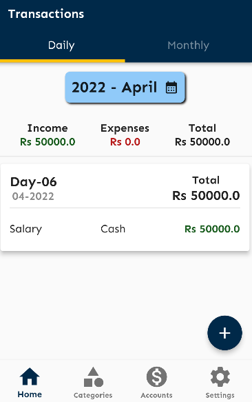
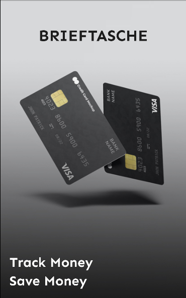
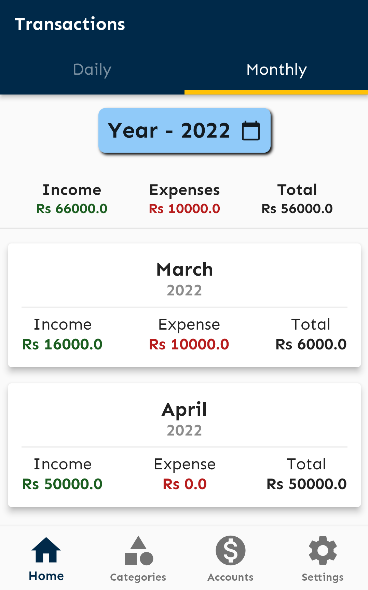
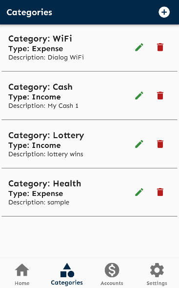
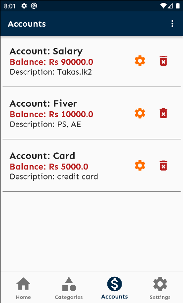
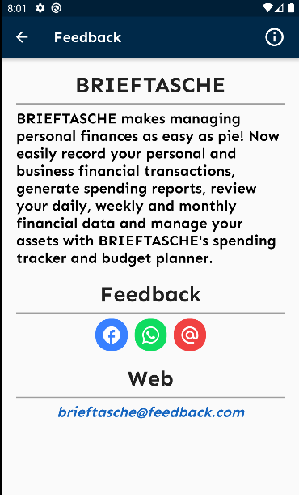

# BudgetManagerApp
CTSE Assignment 1 - Budget recorder app

Group ID - 2022_REG_31 
-------------------------------------------------
Project Name - BudgetRecorderApp
-------------------------------------------------
Group Details
--------------------------------------------------
Member Details:-

| Name  | Student ID | Username|
| ------------- | ------------- | -------------|
| R.Y Senevirathne  | IT19216874 | rasitha11 |
| M.A.A.H Rathnayake | IT19217796   | drex7001 |
| S.L Abeygunawardana | IT19362854   | Sandun01 |

Project Description
--------------------------------------------------
As a budget recorder app user i need to be able to record my income and expenses and store them

Technologies
------------------------------------------------

 
     
    
     
     
     

Trailer
--------------------------------------------------
[App Trailer](https://youtu.be/-MCRcobQzV4)  
[How to use the app](https://www.youtube.com/watch?v=gfiGeONCLrs)

App UI
--------------------------------------------------                                                  

